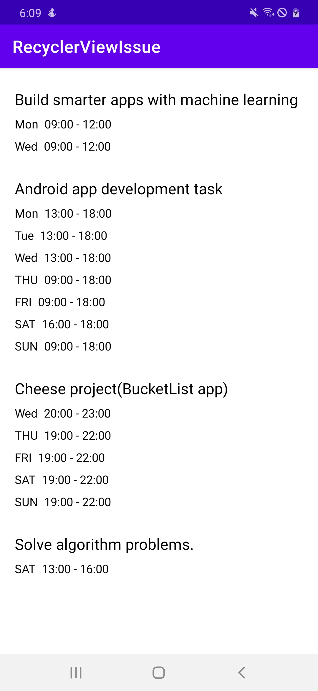

# databinding-nested-recyclerview-issue

ISSUE                         |  Expected Result
:----------------------------:|:----------------------------:
|


### Description
 When databinding is used in nested recyclerview, as much as the number of last recyclerview item,
the number of other recyclerview item is equally forced.


### Code
 ```kotlin:MyScheduleTimeAdapter.kt
    override fun onBindViewHolder(holder: ViewHolder, position: Int) {
        /**
        There is an issue when writing the code as follows.
        holder.onBind(data[position])
         or
        holder.binding.times = data[position]
        **/

        //If you write the code as follows, it works as expected.
        holder.binding.day.text = data[position].day
        holder.binding.time.text = "${data[position].startTime} - ${data[position].endTime}"
    }

    class ViewHolder(val binding: MyScheduleTimeListBinding) : RecyclerView.ViewHolder(binding.root) {
        fun onBind(data: MainActivity.Times) {
            binding.times = data
        }
    }
 ```
